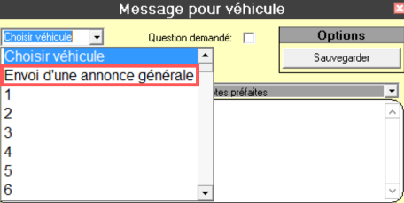

# Annonces générales

<figure><figcaption></figcaption></figure>

### <mark style="color:green;">Il est obligatoire</mark>

* D'envoyer une annonce générale lorsqu'un inspecteur demande les informations d'un chauffeur. Référez-vous à la procédure concernant les inspecteurs.

### <mark style="color:orange;">Il est permis</mark>

* D'envoyer une annonce générale pour prévenir de l'arrivée d'un train **VIA Rail**.
* D'envoyer une annonce générale pour prévenir d'un **accident important** bloquant un axe de circulation principale.

### <mark style="color:red;">Il n'est pas / ou n'est plus permis</mark>

* D'envoyer une annonce générale pour prévenir qu'une voiture passera chercher un membre de sa famille à l'aéroport ou tout autre endroit principalement desservi par un poste à partir ou une file d'attente.
  * La voiture doit simplement retirer son dôme et se présenter sur place comme simple voiture le temps du voyage.
