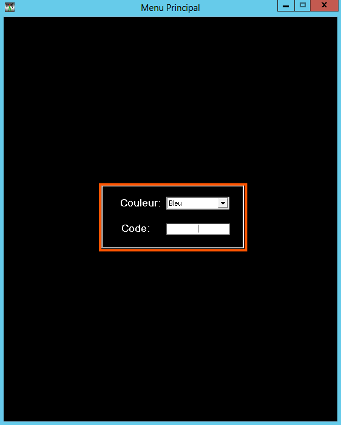
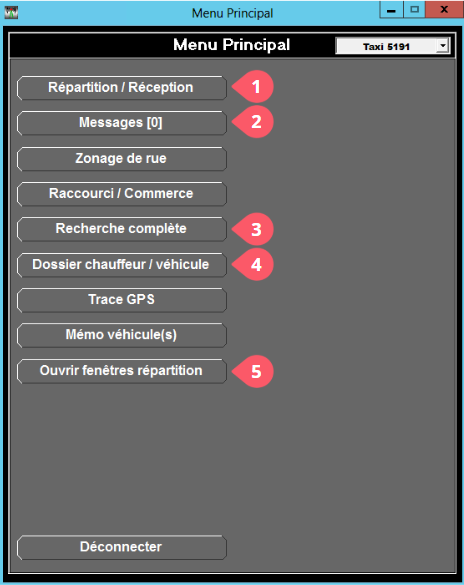

---
layout:
  width: default
  title:
    visible: true
  description:
    visible: true
  tableOfContents:
    visible: true
  outline:
    visible: true
  pagination:
    visible: false
---

# Menu principal

## Menu principal

### Connexion

<figure><figcaption></figcaption></figure>

1. Ouvrir le logiciel de Fraxion en **double-cliquant** dessus.

<figure><figcaption></figcaption></figure>

Il est demandé de se connecter. Pour se faire :

1. Choisissez une couleur [(bleu par défaut)](#user-content-fn-1)[^1].
2. Utilisez votre code et confirmer en appuyant sur "Entrer".

### Menu principal

<figure><figcaption></figcaption></figure>


Certaines options visibles sur la figure ci-contre ne seront peut-être pas disponibles, selon les droits et permission de votre compte utilisateur.


Une fois connecté, vous accédez au menu principal de Fraxion, permettant de consulter tous les outils nécessaires à la répartition d'appels.

1. Ouvre uniquement la fenêtre de Répartition
2. Ouvre une boîte de Messages qui peuvent être envoyés aux et entre les employés.
3. Ouvre la fenêtre permettant d'effectuer des recherches d'appels précises.
4. Ouvre le dossier des chauffeurs, des membres et les informations des véhicules, permettant de faire des modifications et de mettre à jour certaines informations.
5. Permet d'ouvrir **toutes les fenêtres** utilisées pour la Répartition d'un seul coup : réception des appels, répartition des appels et tableau d'accrochage

[^1]: Pour la suite des exemples, le logiciel sera présenté avec la couleur grise, par soucis de confort pour mes petits yeux sensibles.  @CL
