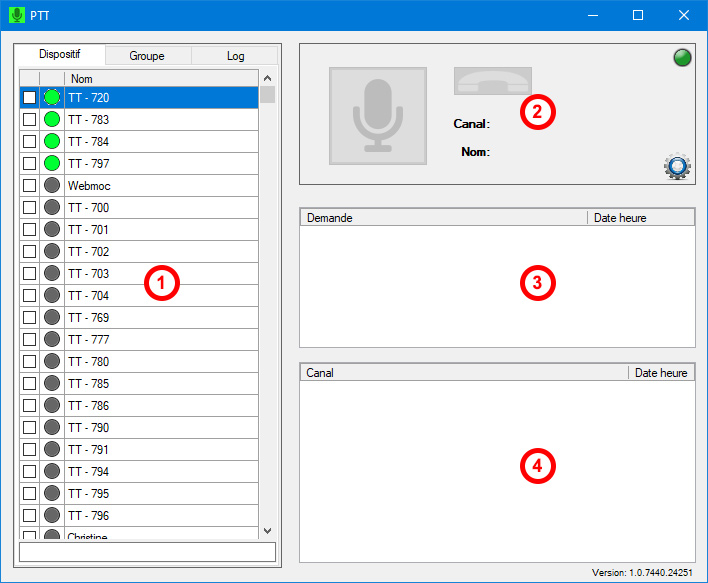

# Push-To-Talk (PTT)


{% column width="66.66666666666666%" %}
Le PTT de Fraxion est un outil de communication entre la répartition et la flotte des véhicules par micro. <mark style="background-color:yellow;">**Cet outil est uniquement utilisé par les chauffeurs de**</mark> [<mark style="background-color:yellow;">**Taxis Unis à Chicoutimi**</mark>](../../10.-coop-taxi-unis.md)<mark style="background-color:yellow;">**.**</mark>

### **Fonctionnement du PTT**

*  Dans ce rectangle, tous les chauffeurs, les répartiteurs et les téléphonistes connectés ont une pastille verte et sont en haut de liste.
  * Les onglets "Dispositif", "Groupe" et "Log" offrent ces options :
    * **Dispositif** liste tous les véhicules, répartiteurs et téléphonistes connectés ou non.
    * **Groupe** liste les véhicules réunis en groupes, connectés ou non (par exemple, un groupe de vans adaptées).
    * **Log** permet de lister un journal de toutes les dernières actions. C'est également à cet endroit qu'on peut réécouter une conversation.
  * Il suffit de double-cliquer pour ouvrir un canal de conversation entre vous et une autre personne.
  * En cochant plusieurs personnes, il est possible de choisir l'option `Clique-droit > "Créer un canal"` pour ouvrir un canal de conversation à plusieurs en même temps.
*  Voici les éléments du rectangle :
  * Le **microphone** permet de discuter avec le canal ouvert. La couleur du bouton change selon l'activité. Il faut appuyer sur celui-ci et le maintenir enfoncer durant tout votre message. _Il est conseillé de compter "1 hippopotame" avant de parler une fois le bouton enfoncé, puis "1 hippopotame" une fois terminé de parler avant de relâcher le bouton._
    * **Gris :** inactif
    * **Vert :** vous pouvez parler
    * **Mauve :** quelqu'un vous répond
  * Le **combiné de téléphone** sert à fermer le canal actif. Lorsqu'il est rouge, cela signifie qu'un canal est encore ouvert.&#x20;
  * L'**icone d'engrenage** dans le coin droit inférieur permet d'ajuster vos préférences.
*  Dans cet espace s'afficheront **les demandes de communications** des chauffeurs.
  * Une notification sonore indique aux répartiteurs qu'un chauffeur tente de communiquer avec la répartition.
  * La demande s'affiche en rouge tant qu'aucun répartiteur ne l'a acceptée.
  * Dès qu'un répartiteur accepte la demande, un canal s'ouvre et s'affiche dans le rectangle ci-dessous.
*  Tous les **canaux ouverts** s'afficheront ici.
  * En appuyant sur le micro, les chauffeurs et/ou les répartiteurs qui présents dans le canal pourront communiquer ensemble.
  * Il est très important de fermer chaque canal lorsque les communications sont terminées, autrement un chauffeur ne pourra pas rappeler la répartition lorsqu'il en aura besoin.




<figure><figcaption></figcaption></figure>


