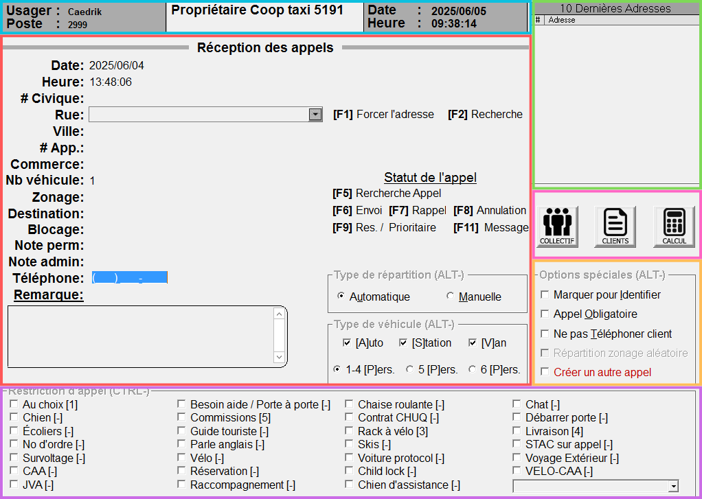
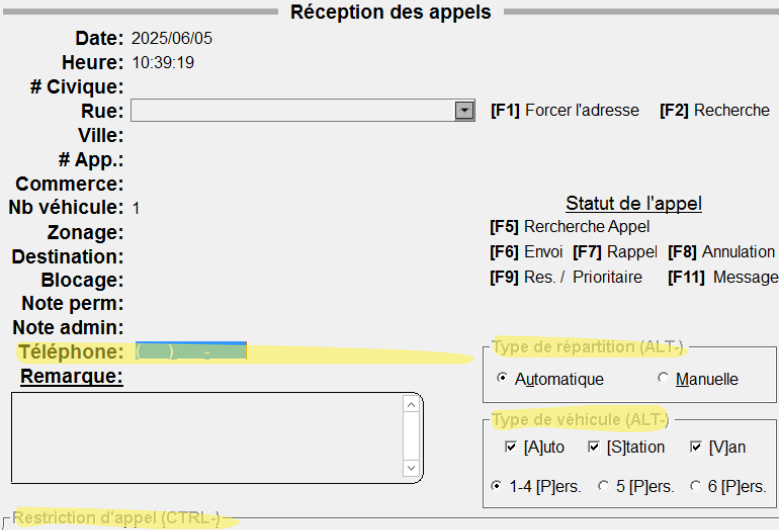
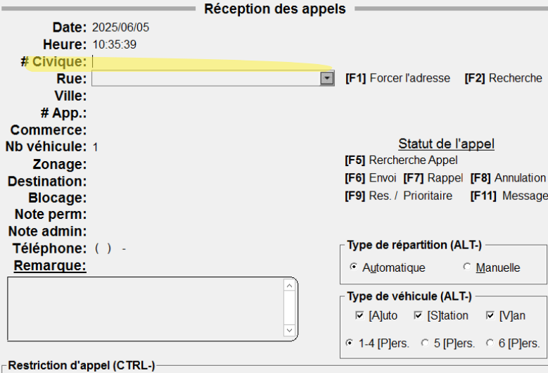
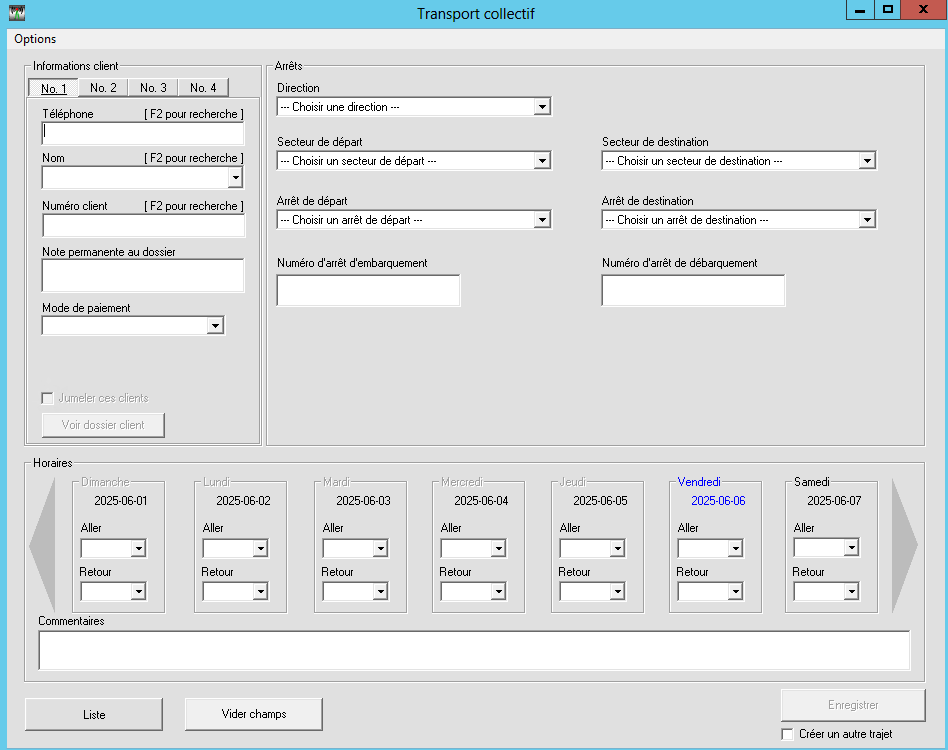
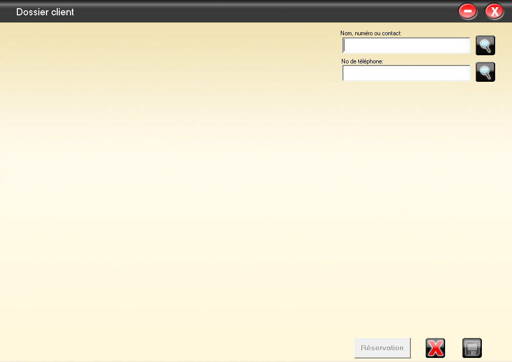
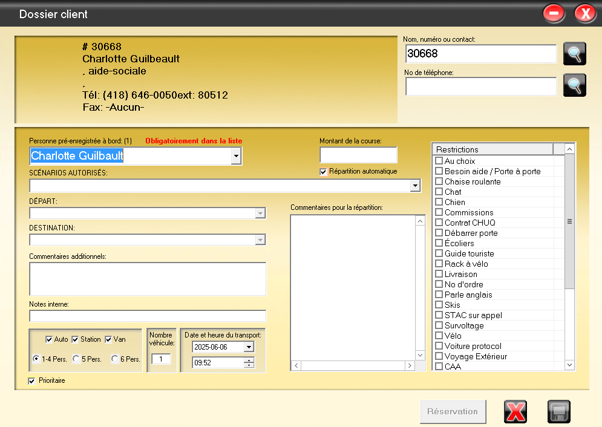

---
layout:
  width: default
  title:
    visible: true
  description:
    visible: true
  tableOfContents:
    visible: true
  outline:
    visible: true
  pagination:
    visible: false
---

# Réception des appels

<figure><figcaption></figcaption></figure>

L'interface de la réception des appels peut sembler intimidante, mais elle le devient beaucoup moins une fois séparée en petits carrés mignons de couleur et attaqué une partie à la fois.

## <mark style="color:blue;background-color:blue;">Bleu, entête</mark>

L'entête de la réception des appels permet d'identifier en un clin d'œil certaines informations qui, pour la plupart, n'auront pas de réellement impact sur la prise d'un appel.

* **Usager** : Nom du téléphoniste connecté (enchanté)
* **Poste** : Numéro du poste téléphonique
* **Nom** : Nom de la compagnie concernée pour la [prise d'appel](#user-content-fn-1)[^1]
* **Date / Heure** : Correspond à la date et à l'heure actuelle de l'ordinateur

## <mark style="color:red;background-color:red;">Rouge, prise d'appel</mark>

La fenêtre principale permet d'inscrire toutes les informations nécessaire à l'envoi d'un appel dans le système de répartition.

### Modes

* Il existe deux modes d'affichage assez subtils : **automatique** et **manuel**. Pour les différencier, il suffit de regarder la position du curseur.
  * En **automatique**, le numéro de téléphone sera en bleu, prêt à inscrire automatiquement le numéro du prochain client.
  * En **manuel**, le curseur est prêt à prendre le numéro civique de l'adresse.
* Il est possible d'alterner entre les deux modes en appuyant sur la touche <kbd>**Echape**</kbd>**&#x20;(ESC)**.
  * Faites attention, toutes les informations de la fenêtre seront effacées et réinitialisées.
* Il est possible de valider chaque saisie d'information en appuyant sur **Entrer** ou **TAB** sans avoir peur d'envoyer un appel incomplet.

| Mode saisie automatique                                                   | Mode saisie manuelle                   |
| ------------------------------------------------------------------------- | -------------------------------------- |
|  |  |

### Saisie des informations

* **Date** : Il est possible de modifier manuellement la date d'un appel, [notamment pour une réservation](#user-content-fn-2)[^2].
* **Heure** : Même chose, changer l'heure de l'appel.
  * Faites attention, l'heure (mais aussi la date) se rafraichissent seulement en mode **automatique**, lorsqu'un nouveau numéro de téléphone est capturé en décrochant le combiné.
* **# Civique** : Le numéro civique de l’adresse
* **Rue** : Nom de la rue, avec les particules à la fin (ex : `RONDE DE LA` ou `STE FOY DE`).
  * Certaines rues, chemins ou avenues sont abrégées (ex : `STE FOY DE`, plutôt que `SAINTE FOY`).
  * Il n'y a pas de trait d'union.
  * La case sert également de recherche et proposera des choix en fonction de ce qu'on écrit.
  * Il est également possible de récupérer l'adresse complète de certains commerces ou restaurants directement en écrivant leur nom dans la case (ex : `PROMENADES` permettra de récupérer `PROMENADES BEAUPORT, BEAUPORT` et en appuyant sur <kbd>**Entrer**</kbd>, toute l'adresse du centre commercial s'ajoutera à l'appel).
  * Appuyer sur <kbd>**Entrer**</kbd> une fois le numéro civique et la rue ajouté placera l'appel en **mode adresse confirmée** et certaines informations complémentaires seront ajoutées (ex : zonage, ville, remarque, etc.).
* **Ville** : Permet de sélectionner la ville si l'adresse existe dans plusieurs villes/secteurs (ex : il existe beaucoup trop de rues/avenues/routes `ÉGLISE DE L'`).
* **# App.** : Indiquer le numéro d'appartement au besoin, notamment pour des livraisons.
  * Toutefois, nous n'encourageons pas nos clients à attendre chez eux, et un chauffeur n'est pas obligé de quitter son véhicule et d'aller sonner à une adresse.
* **Commerce** : S'il y a des commerces liés à l'adresse (ou d'autres options de porte pour un hôpital ou un centre commercial).
* **Nb véhicule** : `1` par défaut. Permet d'envoyer plusieurs véhicules au besoin (ex : choisir `2` dupliquera l'appel et ajoutera `[1/2]` et `[2/2]` dans la remarque).
* **Zonage** : En choisissant une adresse, les zones dans lesquelles l'appel sera envoyé seront ajoutées automatiquement. Il est toutefois possible de les modifier ou d'en ajouter au besoin (ex : lorsqu'une adresse est [forcée manuellement](#user-content-fn-3)[^3])
* **Destination** : Il est possible d'ajouter une adresse de destination.
* **Blocage** : Si des véhicules sont bloqués pour l’adresse, ou si un client demande de ne pas avoir "tel numéro de taxi", il est possible d'inscrire le numéro de voiture dans cette case.
* **Note permanente** : Note permanente s'affichant dans la tablette.
* **Note admin** : Note permanente s'affichant uniquement dans cette case pour le répartiteur.
* **Téléphone** : Numéro de téléphone du client.
  * En **mode saisie automatique**, il sera ajouté automatiquement, mais il peut être nécessaire de l'ajouter manuellement (ex : pour une réservation prise depuis un numéro masqué).
  * En **mode saisie manuelle**, si Fraxion n'est pas en **mode adresse confirmée**, inscrire un numéro de téléphone et appuyer sur <kbd>**Entrer**</kbd> permettra de récupérer les 10 dernières adresses du client voir encadré herbe
* **Remarque** : Nous permet d'ajouter toutes les informations complémentaires d'un appel (ex : porte, nom du client, nombre de bagages, etc.).
  * Dans cette case, appuyer deux fois de suite sur <kbd>**Entrer**</kbd> enverra l'appel dans le système de répartition.

### Touches de fonction

* **\[**<kbd>**F1**</kbd>**], forcer l'adresse** : Permet de forcer une adresse que Fraxion ne trouve pas. Seuls les opérateurs peuvent utiliser cette fonction et ne sert donc qu'en dernier recours.
* **\[**<kbd>**F2**</kbd>**], recherche** : Permet de faire une recherche d'adresse avec ce qu'il y a d'écrit dans la case "Rue" (ex : `PROMEN` et <kbd>**F2**</kbd>ouvrira une fenêtre avec toutes les rues, remarques, commerces correspondant à `PROMEN`, dont les Promenades Beauport).
* **\[**<kbd>**F5**</kbd>**], recherche appel** : Ouvre la fenêtre de recherche d'appel.
* **\[**<kbd>**F6**</kbd>**], envoi** : Envoie l'appel dans le système de répartition. Par sécurité, il est impossible d'envoyer un appel sans qu'il soit en **mode adresse confirmée**.
* **\[**<kbd>**F7**</kbd>**] et \[**<kbd>**F8**</kbd>**]** : Nous n'utilisons pas ces raccourcis.
* **\[**<kbd>**F9**</kbd>**], réservation ou prioritaire** : Permet d'envoyer un appel prioritaire dans le système de répartition, ou de programmer une réservation.
* **\[**<kbd>**F11**</kbd>**], message** : Permet d'envoyer une annonce générale ou un message tablette à une voiture.

### Répartition ou véhicule

* **Type de répartition** : Permet de choisir si l'appel sera réparti automatiquement par le système ou manuellement par le répartiteur une fois la touche <kbd>**F6**</kbd> appuyée. Par défaut, tous les appels sont (et doivent être) envoyés de façon automatique.
* **Type de véhicule** : Permet de choisir quel type de véhicule envoyé. Auto (ou berline), Station (ou VUS), Van. Au besoin, il est également possible d'identifier le nombre de personnes.

## <mark style="color:purple;background-color:purple;">Mauve, restrictions</mark>

Lorsqu'une restriction est cochée, l'appel sera transmis uniquement aux véhicules ou chauffeurs qui acceptent de desservir ce type d'appel. Elles agissent comme un filtre.

Par exemple, si une cliente demande un taxi avec son chat, le téléphoniste doit cocher la case `Chat`. L'appel sera alors proposé seulement aux chauffeurs qui acceptent les chats.

Vous trouverez une description complète de [toutes les restrictions dans ce chapitre](restrictions.md).

## <mark style="color:green;background-color:green;">Vert, dernières adresses</mark>

Il est fréquent qu'un client appelle pour commander un taxi à une adresse pour laquelle il a déjà appelé (domicile, travail, etc.). La fenêtre des **10 dernières adresses** permet de sélectionner facilement l'une de celles-ci et d'envoyer toutes les informations nécessaires dans le tableau de gauche.

* Pour choisir une des 10 dernières adresse, il suffit de **double-cliquer** sur celle-ci.
  * On peut également utiliser les raccourcis <kbd>Alt + (chiffre)</kbd> pour sélectionner l'adresse rapidement (ex : <kbd>Alt + 0</kbd> pour choisir la 10e adresse).

Ces adresses sont sauvegardées automatiquement chaque fois qu'un appel associé à un numéro de téléphone est envoyé dans le système. Sans numéro de téléphone, pas de sauvegarde.


Il est recommandé de toujours jeter un coup d'œil à cette fenêtre, elle nous permet de sauver beaucoup de temps et d'envoyer un appel sans se tromper dans l'adresse.


## <mark style="color:orange;background-color:orange;">Orange, options spéciales</mark>

* **Marquer pour Identifier** permet de mettre une couleur spéciale sur l'appel.
* **Appel obligatoire** fait en sorte que l'appel ne peut être refusé s'il atterrit dans une tablette. Le chauffeur ne pourra pas la renvoyer dans le système de répartition.
* **Ne pas Téléphoner client** désactive le bouton "Téléphone" permettant d'appeler le client lorsque le chauffeur est arrivé devant l'adresse.
* **Répartition zonage aléatoire** choisit une zone aléatoire dans les dessertes. <mark style="color:red;">**Nous n'utilisons pas cette option.**</mark>
* **Créer un autre appel** va dupliquer l'appel pour envoyer un autre véhicule et permettre de conserver toutes les informations déjà enregistrées, utilise pour créer plusieurs réservations à différentes dates.

## <mark style="color:red;background-color:red;">Rose, modules</mark>

### Collectif

<figure><figcaption></figcaption></figure>

Ce module permet de réserver des transports collectifs. <mark style="color:red;">**Nous n'utilisons plus ce système présentement.**</mark>

### Clients

| Recherche                              | Compte client                          |
| -------------------------------------- | -------------------------------------- |
|  |  |

Les dossiers/comptes clients nous permettent de créer des "[numéros d'ordre](../../numeros-dordre.md)". Ceux-ci permettent d'envoyer des appels qui seront facturés plus tard, ce qui permet à certains de nos clients (entreprises, institutions, etc.) d’offrir un service de transport à leurs usagers ou employés sans que ces derniers aient à payer le taxi eux-mêmes.

* Chaque numéro d'ordre est identifié par un chiffre (ex : 30669). Dans la fenêtre de recherche, il est également possible de trouver un compte client en utilisant le nom d'un usager, son numéro de téléphone, etc.
* Un numéro d'ordre peut expirer. Dans ce cas, l'entente initiale n'est plus valide et le client doit se référer à son supérieur ou la personne responsable qui lui a donné le numéro d'ordre.
  * Si une personne responsable souhaite renouveler son entente et son numéro d'ordre, elle doit être référée à la Direction de la centrale.
* **Personne pré-enregistrée à bord** : Permet d'identifier le client ou l'usager qui prendra le taxi. Certains numéros d'ordre possèdent une liste préétablie de personnes autorisées : il faut s'y référer et sélectionner la bonne personne. S'il n'y a personne dans la liste, il faut simplement inscrire le nom complet du client.
* **Scénarios autorisés** : Chaque numéro d'ordre est unique et peut être paramétré selon des itinéraires précis. Il est également possible qu'aucun scénario ne soit programmé d'avance et que toutes les adresses de départ et de destination soient autorisées.
  * `Départ flexible -> Destination flexible` permet par la suite de sélectionner n'importe quelle adresse valide.
* **Départ/Destination** : Selon le scénario, l'adresse de départ et de destination seront déjà sélectionner. S'il s'agit d'un scénario flexible, il faudra ajouter les adresses en appuyant sur le  et en effectuant une recherche par numéro civique et nom de rue.
* **Commentaires additionnels** : Permet d'ajouter des détails supplémentaires à l'appel. Ils seront ajoutés à l'appel comme s'ils avaient été inscrits dans la section "remarque" et pourront être lus par le chauffeur.
* **Options** : Comme pour un appel, permet de sélectionner le type de véhicule, le nombre de personne, le nombre de véhicules, la date et l'heure du transport.
* **Montant de la course** : Certains scénarios peuvent avoir un "[taux fixe](../../ctq/tarifs.md)" selon le scénario. Il sera ajouté automatiquement à la sélection du scénario, autrement il n'y a pas de taux fixe.

[^1]: Taxi Coop 5191 s'occupe également de la répartition de la compagnie Taxi Unis à [Chicoutimi](../../chicoutimi.md).

[^2]: Il est possible de changer la date et l'heure d'un appel de deux façons : directement lors de sa saisie, ou en envoyant un appel avec la touche **F9**.

[^3]: Si un répartiteur ne trouve pas l'adresse du client dans notre système, il doit transférer le client à un poste opérateur qui pourra faire des recherches supplémentaires et forcer une adresse au besoin. <mark style="background-color:red;">**Seuls les opérateurs ont le droit de forcer des adresses.**</mark>
