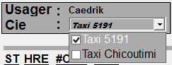

# Répartition des appels

<figure><figcaption></figcaption></figure>

## <mark style="color:red;background-color:red;">Rouge, entête</mark>

L'entête de la répartition des appels permet d'identifier en un clin d'œil certaines informations qui, pour la plupart, n'auront pas de réellement impact sur la prise d'un appel.

* **Usager** : Nom du téléphoniste connecté
* **Poste** : Numéro du [poste téléphonique](../../5.-postes.md)
* **Nom** : Nom de la compagnie concernée pour la prise d'appel
* **Date / Heure** : Correspond à la date et à l'heure actuelle de l'ordinateur

## <mark style="color:green;background-color:green;">Vert, répartition des appels</mark>

<figure><figcaption></figcaption></figure>

L'encadré principal permet de suivre la répartition des appels en temps réel.

### Exemple d'appels en attente

1. Un appel réparti automatiquement (pastille verte), en attente et prioritaire (fond encadré vert). On peut d'ailleurs remarquer le petit cadre noir autour de l'appel et le curseur au bout de la ligne à droite. <mark style="background-color:yellow;">Cet appel est présentement "sélectionné".</mark>
2. Un appel en attente qui vient tout juste d'être refusé par un chauffeur (pastille rouge), et qui sera renvoyé sous peu dans une tablette.

### Informations

* **ST :** Statut de l'appel
  *  **Appel réparti automatiquement**, en attente. Quand c'est vert, tout va bien.
  * **Appel réparti, en attente, mais "détaché de ses dessertes"**, c'est à dire que toutes les voitures de toutes les zones peuvent prendre cet appel (pas seulement les zones principales desservies par l'appel).
  * **Appel en répartition manuelle.** Cet appel est en attente dans notre système, mais n'est pas proposé aux voitures selon leur ordre dans les zones. Soit il attend patiemment d'être attribué (par exemple, pour un contrat en particulier ou une formation de chauffeur sur la route), soit il s'agit d'une mauvaise manipulation.
  * **Le système n'est pas en mesure de répartir l'appel.** Le plus souvent, ce statut survient quelques instants lorsqu'un chauffeur remet son appel dans le système, juste avant d'être renvoyé dans une autre tablette ou de redevenir en attente.
  * **Appel repris par la répartition** (de façon manuelle).
  * **Appel à vérifier/surveiller par la répartition.**
* **HRE :** L'heure à laquelle l'appel a été créé.
* **#CIV. :** Le numéro civique de l'adresse.
* **RUE :** Le nom de la rue de l'adresse.
* **Espace pour la remarque :**&#x20;
* **ZONAGE :** La zone principale de l'adresse.
* **#V :** Un espace permettant d'inscrire le numéro d'une voiture.

## <mark style="color:purple;background-color:purple;">Violet, touches de fonction</mark>

* **\[**<kbd>**F1**</kbd>**], Info. voiture** : [Voir ci-dessous](repartition-des-appels.md#fenetre-dinfo-voiture).
* **\[**<kbd>**F2**</kbd>**], Info. appel** : [Voir ci-dessous](repartition-des-appels.md#fenetre-dinfo-appel).
* **\[**<kbd>**F3**</kbd>**], Activer mode "rush"** : Retire toutes les zones de tous les appels en attente, c'est-à-dire que tous les appels en attente seront proposés dans toutes les zones et à toutes les voitures connectées.
* **\[**<kbd>**F4**</kbd>**], Fermer la session** : Ferme la fenêtre. Appuyer deux fois ferme la session complètement.
* **\[**<kbd>**F5**</kbd>**]**, **Recherche d'appels** : Ouvre la fenêtre de recherche d'appels.
* ~~**\[**<kbd>**F6**</kbd>**]**, **Ouvrir Compte Direct** : Ne fonctionne pas chez nous.~~
* **\[**<kbd>**F8**</kbd>**], Effacer Premier Message** : Permet d'effacer les messages de répartition.
* **\[**<kbd>**F9**</kbd>**], Tableau Accrochage** : Permet d'ouvrir le tableau d'accrochage.
* **\[**<kbd>**F10**</kbd>**], Reception d'appel :** Permet de changer la fenêtre pour celle de la [réception des appels](reception-des-appels.md).
* **\[**<kbd>**F11**</kbd>**], Envoyer message** : Permet d'envoyer une annonce générale ou un message tablette à une voiture.
* **\[**<kbd>**F12**</kbd>**], Options :** Permet d'ouvre le menu d’options supplémentaires.

### Fenêtre d'info voiture

<figure><figcaption></figcaption></figure>

Une fois ouverte grâce à la touche <kbd>**F1**</kbd> , la <mark style="background-color:green;">position du curseur (surlignée en vert)</mark> nous permet d'inscrire le numéro d'un véhicule et d'appuyer sur <kbd>**Entrer**</kbd> pour récupérer ses informations actuelle.

* La voiture peut être connectée et en train de servir l'appel d'un client, ou juste être en attente d'un prochain client. La voiture peut également être déconnectée. Dans les deux cas, cette recherche nous permet de voir le dernier appel dans la tablette.

<figure><figcaption></figcaption></figure>

Sur cette fenêtre, les actions suivantes peuvent être effectuées :

* **\[**<kbd>**F1**</kbd>**], No Load** : S'il n'y a personne a l'adresse, on place l'appel en "No Load".
* **\[**<kbd>**F2**</kbd>**], Reprise :** On reprend l'appelle de la tablette et la replace en attente dans la répartition.
* **\[**<kbd>**F5**</kbd>**]**, **Recherche** : Ouvre une recherche d'appels avec l'adresse.
* **\[**<kbd>**F8**</kbd>**], Annulation** : Si l'appel est annulé par le client par exemple, on l'annule.
* **\[**<kbd>**F9**</kbd>**], Confirmé Appel** : Permet d'ouvrir le tableau d'accrochage.
* **\[**<kbd>**F11**</kbd>**], Ouvrir Module** : Permet d'envoyer une annonce générale ou un message tablette à une voiture.


Cette fenêtre peut être refermée en appuyant sur <kbd>**Esc**</kbd>.


### Fenêtre d'info appel

<figure><figcaption></figcaption></figure>

En appuyant sur la touche <kbd>**F2**</kbd> sur un appel sélectionné dans la fenêtre de répartition, une fenêtre d'information plus complète s'ouvre. <mark style="background-color:yellow;">La remarque y est lisible dans sa totalité.</mark>


Cette fenêtre peut être refermée en appuyant sur <kbd>**Esc**</kbd>.


## <mark style="color:blue;background-color:blue;">Bleu, remarque de l'appel</mark>

**Cette case n'est pas très fiable pour récupérer l'information complémentaire d'un appel.** Elle devrait normalement afficher toute la remarque d'un appel sélectionné dans la fenêtre de répartition au-dessus... mais semble disparaitre et/ou revenir dès qu'un nouvel appel est ajouté/retiré de la répartition en attente, ce qui arrive très fréquemment et empêche la lecture. 🫠 Nous préférons utiliser la touche <kbd>**F2**</kbd>, comme présenté ci-dessus.

## <mark style="color:orange;background-color:orange;">Orange, derniers appels répartis</mark>

La liste des derniers appels repartis affiche les derniers appels distribués dans les tablettes.

* **Voiture :** Le numéro de la voiture.
* **S (Type d'appel) :**&#x20;
  * **TA** pour Transport Adapté.
  * **C** pour Cancel, donc annulé.
  * **NL** pour NoLoad, donc client non présent.
  * **DC** pour Dossier Client, donc [Numéro d'Ordre](../../11.-numeros-dordre.md)**.**
  * **M** pour Message, ce n'est pas un appel mais un message envoyé par la répartition.
* **Adresse :** L'adresse de l'appel (ou toute autre information pertinente selon le statut ci-dessus).

#### Couleurs des appels

* **Noir :** Indique une potentielle latence de connexion _**OU**_ que la tablette est déconnectée et/ou que l'appel ou le message ne sont pas distribués correctement. <mark style="background-color:yellow;">Cela peut arriver lorsqu'un chauffeur se déconnecte sans avoir complété son appel.</mark> \
  **L'appel ou le message est toujours marqué comme étant noir par le système** une fraction de seconde avant de passer au bleu.\
  \
  .png>)\
  Dans l'exemple ci-dessous, on peut voir que la voiture 539 n'a pas reçu le message, indiqué comme "Non distribué".
* <mark style="color:blue;">**Bleu :**</mark> L'appel est en attente d'être accepté ou d'être refusé. Aux dernières nouvelles, un appel doit être accepté dans les 30 secondes (à confirmer #todo), autrement il sera refusé.
* <mark style="color:purple;">**Violet gras :**</mark> L'appel est en cours de refus, il sera retourné dans la répartition sous peu.
* <mark style="color:red;">**Rouge :**</mark> L'appel est accepté dans la tablette.
