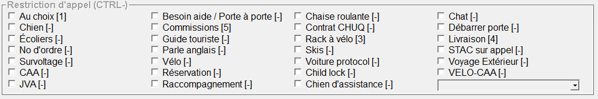

# Restrictions

<figure><figcaption></figcaption></figure>

Chaque restriction agit comme un filtre sur l'appel qui sera envoyé dans le système. Ce filtre permet d'offrir l'appel uniquement aux voitures acceptant de faire ce type d'appel.


Il faut savoir qu'en répartissant un appel, nous ne sommes pas responsables des informations que les clients décident de nous fournir (ou l'absence de celles-ci). Par exemple, si un client est accompagné d'un chat en cage et qu'il ne l'annonce pas lors de la prise d'appel, tout chauffeur est en droit de refuser de prendre le client une fois arrivé sur place.


Vous trouverez ci-dessous toute la liste des restrictions d'appel que nous utilisons, en plus d'une explication pour chaque cas de figure :

* **Au choix :** Cette restriction se combine principalement avec d'autres restrictions. Elle permet à la voiture d'accepter ou de remettre l'appel sans pénalité lorsque celui-ci atterrit dans sa tablette.
  * **Par exemple, voyage extérieur et au choix :** les voyages extérieurs (voir plus bas) ne sont pas obligatoires car ils demandent de conduire sur de plus longues distances et certains chauffeurs ont peut-être déjà 10/12 heures de taxi dans les fesses.
* **Chien :** Si le client est accompagné d'un chien.
  * **S'il s'agit d'un chien d'assistance, nous ne cochons pas cette case.** [Une procédure est dédiée à cette restriction.](../../chien-dassistance.md)
* **Écoliers :**
* **No d'ordre :** Il faut cocher cette case pour tous les numéros d'ordre.
* **Survoltage :** Lorsqu'un client demande un survoltage, il faut cocher cette case. [Une explication du service est donnée plus en détails ici.](../../survoltage-deverrouillage.md)
* **CAA :** À cocher lorsqu'il s'agit d'un appel du CAA. [Une explication du service est donnée plus en détails ici.](../../services/caa/)
* ~~**JVA :** Le service JVA (J'y vais accompagné) est un projet pilote de 5191. Il est toujours en développement.~~
* **Besoin aide / Porte à porte :**
* **Commissions :** Lorsqu'un client veut que le taxi aille acheter quelque chose pour lui. [Une explication du service est donnée plus en détails ici.](../../livraison-commission.md)
* **Guide touriste**
* **Parle anglais :** Lorsqu'un client parle anglais, il faut cocher cette case.
* **Vélo :** Lorsqu'un client veut transporter un vélo dans un coffre, il faut cocher cette case. [Une explication du service est donnée plus en détails ici.](../../transport-de-velo.md)
* **Réservation :** Cette restriction est à titre informative. Elle est cochée automatiquement lorsque vous enregistrez un appel pour plus tard avec la touche <kbd>**F9**</kbd>. [Vous pouvez vous référer au chapitre concernant les réservations.](../../9.-reservations.md)
* **Raccompagnement :** À cocher lorsqu'un client demande un raccompagnement jusqu'à chez lui, avec sa voiture. [Une explication du service est donnée plus en détails ici.](../../raccompagnement.md)
* **Chaise roulante :** Lorsque le client est en chaise roulante. La chaise roulante <mark style="background-color:yellow;">doit être pliable et doit pouvoir rentrer dans le coffre d'une voiture</mark> (quadriporteur motorisé refusé, par exemple).
* **Contrat CHUQ :** Lorsqu'un client indique qu'il paiera sa course avec un coupon du CHU de Québec. Pour plus d'informations, [vous référer au contrat du CHUQ](../../contrats/chuq/).
* **Rack à vélo :** À cocher lorsqu'un client a besoin de transporter plusieurs vélos et demande un "rack à vélo" installé à l'arrière du véhicule. [Une explication du service est donnée plus en détails ici.](../../transport-de-velo.md)
* **Skis :** À cocher si le client doit transporter des skis. L'hiver, certaines de nos voitures installent sur leur toit un caisson pour les transporter plus facilement.
* **Voiture protocol :** À cocher si le client demander une voiture "propre" ou "protocolaire". [Une explication du service est donnée plus en détails ici.](../../voiture-protocolaire.md)
* **Child lock :** Si un client fait la demande d'installer la sécurité pour enfant, le chauffeur devra s'arrêter et l'enclencher sur les portes arrière avant d'aller chercher le client.
* **Chien d'assistance :** [Un protocole est dédié à cette restriction.](../../chien-dassistance.md)
* **Chat :** Si le client doit transporter un chat (habituellement en cage).
* **Débarrer porte :** À cocher lorsque le client a oublié ses clefs à l'intérieur de son véhicule et fait la demande d'un déverrouillage. [Une explication du service est donnée plus en détails ici.](../../survoltage-deverrouillage.md)
* **Livraison :** À cocher lorsque le client demande une livraison. [Une explication du service est donnée plus en détails ici.](../../livraison-commission.md)
* ~~**STAC sur appel :** Cette restriction n'est plus utilisée.~~
* **Voyage Extérieur :** À cocher lorsqu'un client quitte notre territoire en direction d'une autre ville. [Une explication du service est donnée plus en détails ici.](../../voyage-exterieur.md)
* **VELO-CAA :** À cocher lorsqu'il s'agit d'un appel du CAA pour Assistance-Vélo. [Une explication du service est donnée plus en détails ici.](../../services/caa/caa-assistance-velo.md)

***

* **Formation :** Permet d'identifier un appel comme "de formation", qui ne sera pas traité pas d'autre voiture que celle d'un formateur.
* **Livraison matière biologique :** À cocher lors d'une livraison de matière biologique (glacière, prélèvements, etc.). [Une explication du service est donnée plus en détails ici.](../../livraison-commission.md)
* **Tesla :** Le client veut une Tesla – tous les goûts sont dans la nature.
* ~~**Transport adapté :** Cette restriction n'est plus utilisée.~~
* **MINI-DÉMÉNAGEMENT :** ~~Seule restriction qui a décidé de crier qu'elle existe~~ ; à cocher lorsque le client demande un véhicule pour transporter des boîtes ou un petit meuble. [Une explication du service est donnée plus en détails ici.](../../demenagement.md)
