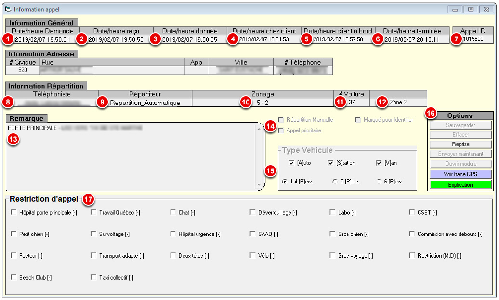

# Informations d'appel

<figure><figcaption></figcaption></figure>

1. **Date/heure Demande :** La date et l'heure de la demande (lorsque le téléphoniste décroche le téléphone) OU la date et l'heure planifiée s'il s'agit d'une [réservation](../../9.-reservations.md).
2. **Date/heure reçu :** La date et l'heure de la création de l'appel (avec la touche <kbd>**F6**</kbd>).
