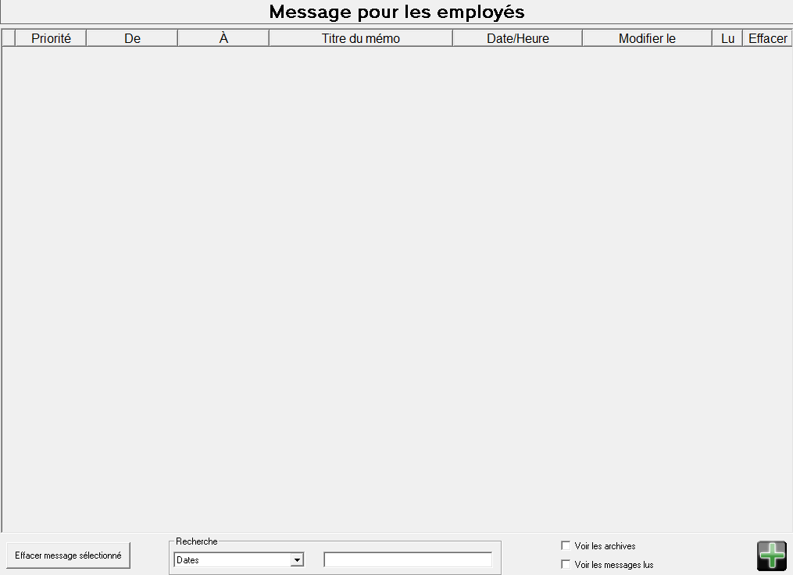

# Messages

<figure><figcaption></figcaption></figure>

<mark style="background-color:yellow;">Ce système est désuet.</mark>

Fraxion dispose d'une boîte de messagerie permettant à l'employeur et/ou aux employés de s'envoyer des messages.

&#x20;Les communications sont désormais traitées directement depuis l'application de Microsoft Teams.
