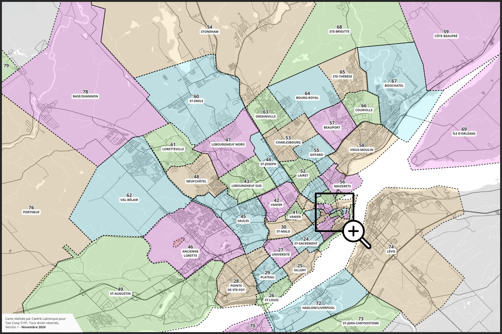
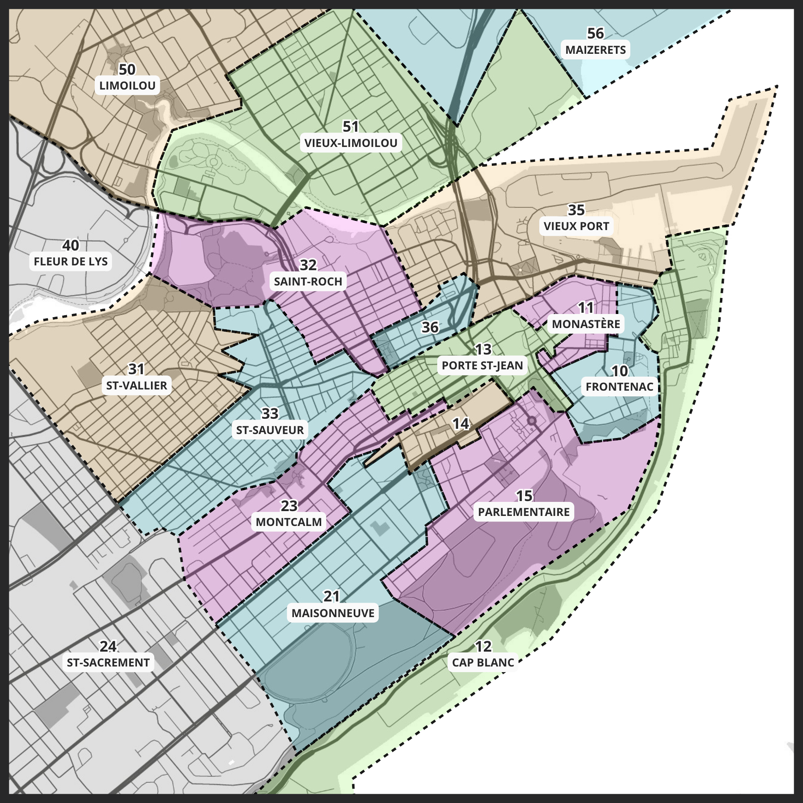
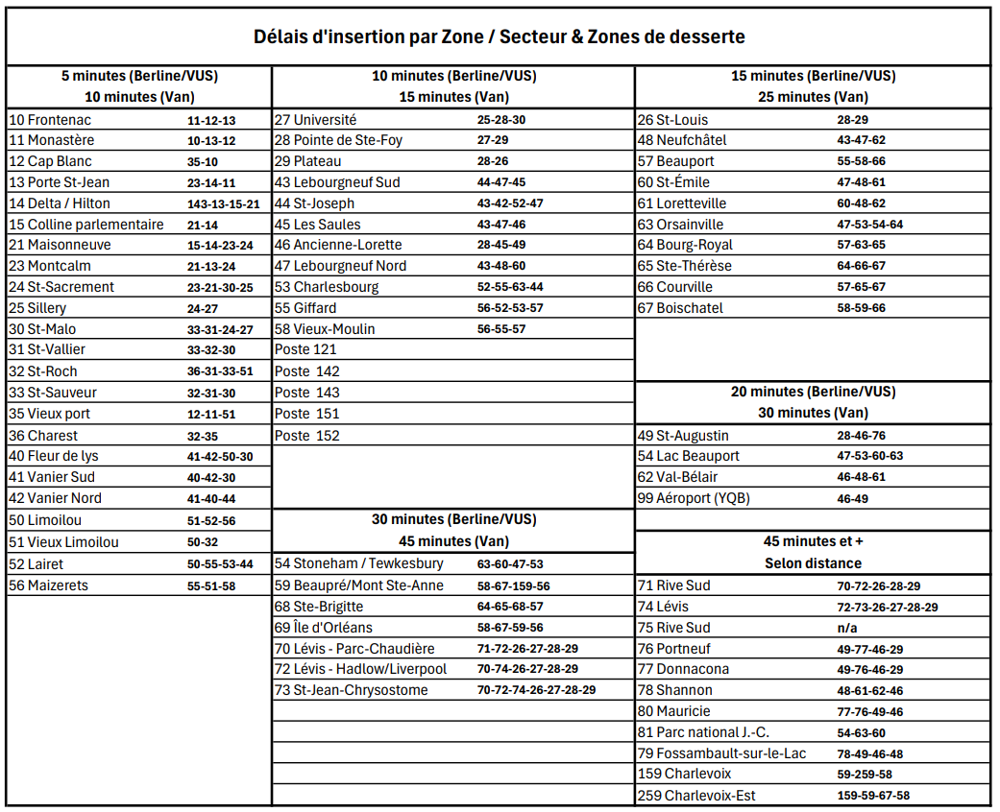

# Zones

Le territoire de la Communauté métropolitaine de Québec que nous desservons est segmenté en différentes « Zones ». Chaque zone possède un numéro qui couvre une superficie précise en prenant en compte la circulation, les sens uniques, les axes ainsi que les artères principaux de la ville. Nous utilisons des zones plutôt que des quartiers pour faciliter la répartition des appels.

* Lorsqu'un client appelle et demande un taxi, sa demande est distribuée au premier taxi en attente dans la zone où se trouve l’adresse d’embarquement.

<figure><figcaption></figcaption></figure>

<figure><figcaption></figcaption></figure>

* Chaque zone possède un numéro qui couvre une superficie précise _en essayant de_ prendre en compte la circulation, les axes et les artères principaux de la ville pour optimiser les déplacements à l'intérieur d'une zone.
* Nous utilisons des zones plutôt que des quartiers pour faciliter la répartition des appels.
* Toutes les adresses de la ville sont associées à au moins une zone.
* Lorsqu’un client appel et demande un taxi, sa demande est distribuée :
  * D'abord au premier taxi en attente dans la zone où se trouve l’adresse d’embarquement,
  * Puis l'appel sera proposé aux zones avoisinantes (aussi appelées « Zones de dessertes »)

## Zones avoisinantes (dessertes) et délais d'insertion

Plusieurs outils nous servent à travailler avec ces zones, comme le tableau ci-dessous, nous permettant de déterminer les zones adjacentes et le délai d’insertion lors des réservations :

<figure><figcaption></figcaption></figure>

## Postes à partir 

Un peu partout sur le territoire de la ville de Québec, certains emplacements sont spécialement réservés aux taxis pour y attendre des clients. On les appelle des **postes à partir**.

Il en existe trois grandes catégories :

1. **Postes privés appartenant à Taxi Coop 5191**\
   Ces terrains sont la propriété directe de la Coopérative. C’est le cas notamment des postes St-Albert et St-Pascal, qui sont exclusivement réservés à nos chauffeurs.
2. **Postes en partenariat avec des entreprises privées**\
   Grâce à des ententes avec certains établissements, les taxis peuvent attendre dans leur stationnement. [C’est le cas, entre autres, pour](#user-content-fn-1)[^1] :
   * Fairmont Le Château Frontenac — 1, rue des Carrières
   * Centre commercial Fleur de Lys
   * Hôtel Hilton Québec — boulevard René-Lévesque Est
   * Hôtel Delta Québec — rue Jean-Jacques-Bertrand
   * Hôtel Le Concorde — Grande Allée Ouest
   * Hôtel de Ville — rue des Jardins
   * Gare du Palais — rue Abraham-Martin
   * Traverse Québec–Lévis — rue des Traversiers
   * Place d’Youville — devant le Capitole de Québec
   * Halles Petit Cartier — avenue Cartier
   * Dépanneur Couche-Tard (18e Rue) — 215, 18e Rue
   * Siège social de Taxi Coop 5191 — 496, 2e Avenue
3. **Postes temporaires**\
   Lors de certains événements majeurs (ex. festivals, congrès, événements au centre Vidéotron ou célébrations ponctuelles comme le FEQ), des postes à partir temporaires peuvent être créés.

[^1]: Cette liste n’est pas exhaustive. Il existe plusieurs autres postes à partir répartis dans la ville.
